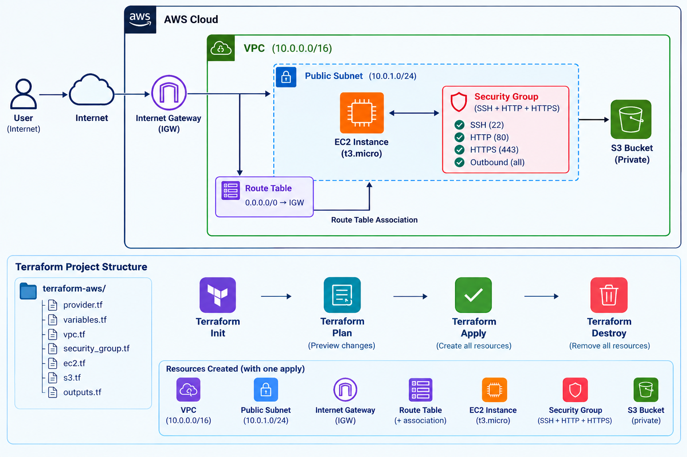

# Terraform AWS Infrastructure — VPC + EC2 + S3

> Complete AWS infrastructure provisioned using Terraform Infrastructure as Code. One command creates everything. One command destroys everything.

---

## Architecture



---

## What Gets Created

```
AWS Account
└── VPC (10.0.0.0/16)
      ├── Internet Gateway
      ├── Public Subnet (10.0.1.0/24)
      │     ├── Route Table → routes 0.0.0.0/0 to IGW
      │     └── EC2 Instance (t3.micro)
      │           ├── Security Group (SSH + HTTP + HTTPS)
      │           └── nginx web server (installed via user_data)
      └── S3 Bucket (private, unique name via random_id)
```

**Total resources: 8**
All created with `terraform apply` — all deleted with `terraform destroy`

---

## Live Result

After `terraform apply` completes:

```
Outputs:
ec2_instance_id  = "i-0a3d8917109a675db"
ec2_public_ip    = "15.206.173.163"
vpc_id           = "vpc-02053f890cd568abb"
public_subnet_id = "subnet-0e25c4ceacb3ea639"
s3_bucket_name   = "terraform-project-storage-2f8e9084"
security_group_id = "sg-0e1eaa80ce25d0c7e"
website_url      = "http://15.206.173.163"
```

Open `website_url` in browser → see the deployed nginx page.

---

## Tech Stack

| Tool | Purpose |
|---|---|
| Terraform v1.15.8 | Infrastructure as Code |
| AWS Provider ~5.0 | Terraform AWS plugin |
| HCL | HashiCorp Configuration Language |
| AWS VPC | Isolated network |
| AWS EC2 (t3.micro) | Virtual machine |
| AWS S3 | Object storage |
| AWS Security Group | Firewall rules |
| AWS IGW | Internet connectivity |
| S3 Backend | Remote Terraform state |

---

## Project Structure

```
terraform-aws/
├── provider.tf          # AWS provider + S3 remote backend
├── variables.tf         # All configurable values
├── vpc.tf               # VPC, subnet, IGW, route table
├── security_group.tf    # Firewall rules
├── ec2.tf               # EC2 instance with nginx user_data
├── s3.tf                # S3 bucket with unique name
├── outputs.tf           # Shows IPs and IDs after apply
├── docs/
│   └── architecture.png # Architecture diagram
├── .gitignore           # Excludes .terraform/, *.tfstate
└── README.md
```

---

## File Explanations

### provider.tf
Configures which cloud provider to use (AWS) and where to store Terraform state (S3 remote backend). Remote state allows team collaboration — multiple engineers share the same state file.

### variables.tf
All configurable values in one place — region, VPC CIDR, subnet CIDR, instance type, AMI ID. Change here and everything updates automatically.

### vpc.tf
Creates the complete network layer:
- **VPC** — isolated network with CIDR 10.0.0.0/16
- **Internet Gateway** — connects VPC to the internet
- **Public Subnet** — 10.0.1.0/24, instances get public IPs automatically
- **Route Table** — routes 0.0.0.0/0 traffic through the IGW
- **Route Table Association** — links the route table to the subnet

### security_group.tf
Firewall rules following least privilege:
- Port 22 (SSH) — remote access
- Port 80 (HTTP) — web traffic
- Port 443 (HTTPS) — encrypted web traffic
- All outbound traffic allowed

### ec2.tf
Creates t3.micro EC2 instance with:
- Ubuntu 22.04 AMI
- Placed in public subnet
- Security group attached
- `user_data` bootstrap script installs and starts nginx automatically on first boot

### s3.tf
Creates a private S3 bucket with:
- `random_id` resource for globally unique bucket name
- All public access blocked — private storage only

### outputs.tf
Displays important values after apply — EC2 IP, VPC ID, S3 bucket name, direct website URL. No need to manually find them in the console.

---

## Setup and Deployment

### Prerequisites

- Terraform installed (`terraform --version`)
- AWS CLI installed and configured (`aws configure`)
- AWS account with IAM user having required permissions
- Existing S3 bucket for Terraform state

### Step 1 — Clone the repository

```bash
git clone https://github.com/sivamani1303/terraform-aws.git
cd terraform-aws
```

### Step 2 — Update backend bucket in provider.tf

```hcl
backend "s3" {
  bucket = "your-terraform-state-bucket"
  key    = "terraform-aws-project/terraform.tfstate"
  region = "ap-south-1"
}
```

### Step 3 — Initialize Terraform

```bash
terraform init
```

Downloads the AWS provider plugin and sets up the S3 backend.

### Step 4 — Preview what will be created

```bash
terraform plan
```

Shows all 8 resources that will be created. No changes made yet.

### Step 5 — Create all infrastructure

```bash
terraform apply
```

Type `yes` when prompted. All 8 resources created in ~2 minutes.

### Step 6 — Open the website

Copy `website_url` from the output and open in browser. Wait 2-3 minutes for nginx to install via user_data.

### Step 7 — Destroy everything (when done)

```bash
terraform destroy
```

Type `yes`. All 8 resources deleted cleanly. No orphaned resources, no surprise bills.

---

## Key Terraform Commands

```bash
terraform init      # Initialize — download providers, set up backend
terraform plan      # Preview changes — no modifications made
terraform apply     # Create/update infrastructure
terraform destroy   # Delete all managed resources
terraform output    # Show output values
terraform state list # List all resources in state
terraform show      # Show current state details
```

---

## Remote State — Why It Matters

State is stored in S3 (`siva-terraform-state-127621462534`) instead of locally.

**Benefits:**
- Multiple team members can work on the same infrastructure
- State is not lost if your laptop is lost
- State changes are atomic — no corruption from simultaneous applies
- Version history of state changes in S3

---

## Security Design

- EC2 Security Group follows **least privilege** — only required ports open
- S3 bucket has **all public access blocked** — private storage
- IAM user for deployment has only required permissions
- No sensitive values hardcoded — all in variables
- `.gitignore` excludes `.terraform/`, `*.tfstate`, `*.pem` — no secrets in repo

---

## Common Issues and Fixes

| Error | Fix |
|---|---|
| `InvalidParameterCombination — instance type not free tier` | Change `instance_type` to `t3.micro` in variables.tf |
| `BucketAlreadyExists` | Change bucket name — S3 names are globally unique |
| `UnauthorizedOperation` | IAM user missing required permissions |
| Website not loading after apply | Wait 2-3 minutes for nginx to install via user_data |
| State locked | Another apply is running or previous one crashed — use `terraform force-unlock` |

---

## Key Concepts Demonstrated

- Infrastructure as Code with Terraform HCL
- Modular file structure — one file per concern
- Remote state management with S3 backend
- Variable-driven configuration — no hardcoded values
- EC2 bootstrap automation with user_data
- Security Group with least-privilege rules
- Resource dependencies — Terraform builds the dependency graph automatically
- Random resource for unique naming
- Output values for easy access to created resource details

---
